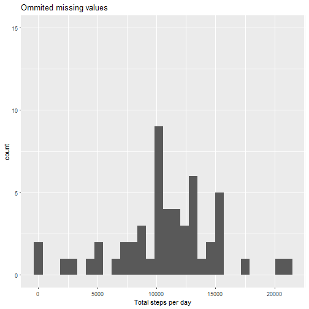
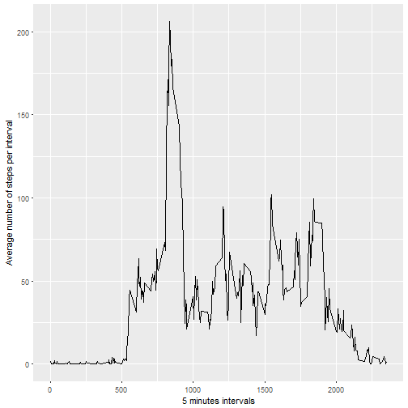
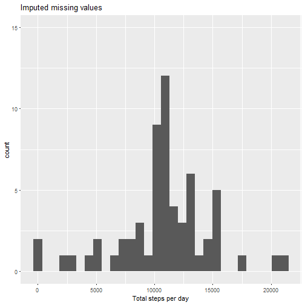
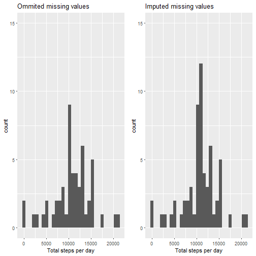
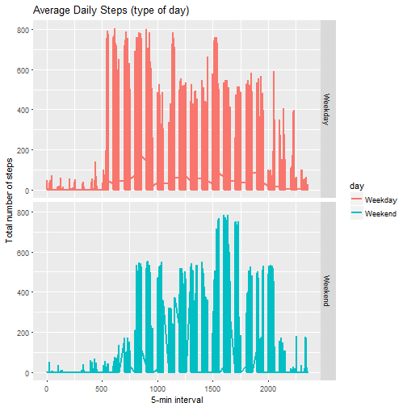

```r
knitr::opts_chunk$set(echo = TRUE)

library(ggplot2)
library(reshape2)
library(gridExtra)
```

# Loading and preprocessing the data


```r
activity_raw<-read.csv(unz("activity.zip", "activity.csv"), stringsAsFactors = FALSE)
activity_df<-activity_raw

activity_df$date<-as.Date(as.character(activity_df$date), "%Y-%m-%d")
activity_df$day<-ifelse(weekdays(activity_df$date) %in% c("Saturday", "Sunday"), "Weekend", "Weekday" ) 

str(activity_df)
```

```
## 'data.frame':	17568 obs. of  4 variables:
##  $ steps   : int  NA NA NA NA NA NA NA NA NA NA ...
##  $ date    : Date, format: "2012-10-01" "2012-10-01" ...
##  $ interval: int  0 5 10 15 20 25 30 35 40 45 ...
##  $ day     : chr  "Weekday" "Weekday" "Weekday" "Weekday" ...
```

# What is mean total number of steps taken per day?

### Calculating the total number of steps taken per day

```r
activity_sum<-aggregate(steps ~ date, data = activity_df, FUN = sum, na.rm = TRUE)
colnames(activity_sum)<-c("date", "steps")

head(activity_sum)
```

```
##         date steps
## 1 2012-10-02   126
## 2 2012-10-03 11352
## 3 2012-10-04 12116
## 4 2012-10-05 13294
## 5 2012-10-06 15420
## 6 2012-10-07 11015
```


```r
hist1<- ggplot(activity_sum, aes(x=steps)) +
  geom_histogram(na.rm = TRUE, bins = 30) + 
  xlab("Total steps per day")+
  ggtitle("Ommited missing values")+
  scale_y_continuous(limits = c(0,15))

hist1
```



Mean number of steps taken each day is 

```r
mean(activity_sum$steps, na.rm = TRUE )
```

```
## [1] 10766.19
```

Median number of steps taken each day

```r
median(activity_sum$steps, na.rm=TRUE)
```

```
## [1] 10765
```


## What is the average daily activity pattern?

### Prepare a data set with the average number of steps taken across all days

```r
activity_mean<-dcast(activity_df, interval ~ . , value.var = "steps", mean, na.rm=TRUE)
colnames(activity_mean)<-c("interval", "mean_steps")

str(activity_mean)
```

```
## 'data.frame':	288 obs. of  2 variables:
##  $ interval  : int  0 5 10 15 20 25 30 35 40 45 ...
##  $ mean_steps: num  1.717 0.3396 0.1321 0.1509 0.0755 ...
```

### Make a time series plot (i.e. type = "l") of the 5-minute interval (x-axis) and the average number of steps taken, averaged across all days (y-axis)

```r
ggplot(activity_mean, aes(x=activity_mean$interval, y=activity_mean$mean_steps))+
  geom_line(na.rm = TRUE) +
  xlab("5 minutes intervals") +
  ylab("Average number of steps per interval")
```



### Which 5-minute interval, on average across all the days in the data set, contains the maximum number of steps?


```r
max_steps<-activity_mean[which(activity_mean$mean_steps==max(activity_mean$mean_steps, na.rm=TRUE)),]
```

On average across all days in the data set interval# **835** contained maximum number of numbers that is **206** steps.

# Imputing missing values

### Calculate and report the total number of missing values in the data set (i.e. the total number of rows with NAs)

```r
sapply(activity_df, function(x) sum(is.na(x)))
```

```
##    steps     date interval      day 
##     2304        0        0        0
```

The following visualization clearly shows that those missing values happen during a certain days during the period when the device wasn't used most likely. 


### Devise a strategy for filling in all of the missing values in the data set.
* I'll undertake simple strategy for imputing missing values and for every missing value we're adding it's average through the 5 min interval.

### Create a new data set activity_impute that is equal to the original data set but with the missing data filled in

```r
activity_impute<-activity_df
l<-length(activity_impute$steps)

for (i in 1:l){
  if (is.na(activity_impute$steps[i])){
    
    index_interval<-activity_impute$interval[i]
    activity_impute$steps[i]<-activity_mean[activity_mean$interval ==  index_interval, "mean_steps"]
    
  }
  
}
str(activity_impute)
```

```
## 'data.frame':	17568 obs. of  4 variables:
##  $ steps   : num  1.717 0.3396 0.1321 0.1509 0.0755 ...
##  $ date    : Date, format: "2012-10-01" "2012-10-01" ...
##  $ interval: int  0 5 10 15 20 25 30 35 40 45 ...
##  $ day     : chr  "Weekday" "Weekday" "Weekday" "Weekday" ...
```
Check if there are NA values left 

```r
sum(is.na(activity_impute$steps))
```

```
## [1] 0
```

### Make a histogram of the total number of steps taken each day and Calculate and report the mean and median total number of steps taken per day. Do these values differ from the estimates from the first part of the assignment? What is the impact of imputing missing data on the estimates of the total daily number of steps?


```r
activity_impute_sum<-dcast(activity_impute, date ~. , sum, value.var = "steps")
colnames(activity_impute_sum)<-c("date", "steps")

hist2<- ggplot(activity_impute_sum, aes(x=steps)) +
  geom_histogram(na.rm = TRUE, bins = 30) + 
  xlab("Total steps per day")+
  ggtitle("Imputed missing values")+
  scale_y_continuous(limits = c(0,15))

hist2
```



### Comparing the histogram for imputed and omitted values data


```r
grid.arrange(hist1, hist2, ncol=2)
```



Mean omitted missing values 


```r
round(mean(activity_sum$steps, na.rm=TRUE),2) 
```

```
## [1] 10766.19
```
Mean imputed missing values 

```r
round(mean(activity_impute_sum$steps),2)
```

```
## [1] 10766.19
```

Difference between mean omitted and mean imputed

```r
round(mean(activity_sum$steps, na.rm=TRUE),2) - round(mean(activity_impute_sum$steps),2)
```

```
## [1] 0
```
Imputing the NA values doesn't change the Mean value

Median omitted missing values 
```r{med-om}
round(median(activity_sum$steps, na.rm=TRUE),2)
```

Median imputed missing values 

```r
round(median(activity_impute_sum$steps),2)
```

```
## [1] 10766.19
```

Difference between median omitted and median imputed

```r
round(median(activity_sum$steps, na.rm=TRUE),2) - round(median(activity_impute_sum$steps),2)
```

```
## [1] -1.19
```
Only median value has been affected by the chosen strategy of imputing the missing values


# Are there differences in activity patterns between weekdays and weekends?

### Create a new factor variable in the data set with two levels - "weekday" and "weekend" indicating whether a given date is a weekday or weekend day.


```r
head(activity_impute)
```

```
##       steps       date interval     day
## 1 1.7169811 2012-10-01        0 Weekday
## 2 0.3396226 2012-10-01        5 Weekday
## 3 0.1320755 2012-10-01       10 Weekday
## 4 0.1509434 2012-10-01       15 Weekday
## 5 0.0754717 2012-10-01       20 Weekday
## 6 2.0943396 2012-10-01       25 Weekday
```

### Make a panel plot containing a time series plot (i.e. type = "l") of the 5-minute interval (x-axis) and the average number of steps taken, averaged across all weekday days or weekend days (y-axis). See the README file in the Git Hub repository to see an example of what this plot should look like using simulated data.


```r
ggplot(activity_impute, aes(x=interval, y=steps, color=day)) + 
  geom_line(size=1) + 
  facet_grid(day~.)+
  labs(title="Average Daily Steps (type of day)", x="5-min interval", y="Total number of steps")
```




